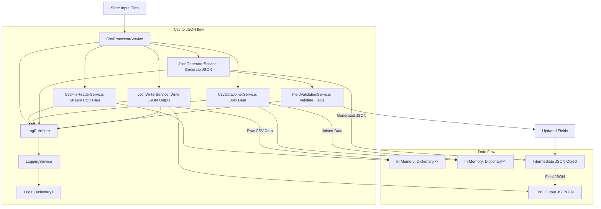

# CSV to JSON with Mapping Documentation

## Overview
This project processes CSV files, maps them to a JSON structure based on predefined mappings, and validates the data using custom rules. The main services used in this project include:

- **CSVProcessorService**: Orchestrates the entire flow from reading CSV files to generating JSON.
- **CsvDataJoinerService**: Joins data across multiple CSV files based on specified relations.
- **JsonGeneratorService**: Generates the JSON structure from the joined data and mappings.
- **FieldValidationService**: Validates and converts fields based on rules in the mapping configuration.
- **LoggingService**: Tracks progress and logs errors or warnings during the process.



You can paste the code into any Mermaid-compatible renderer (e.g., [Mermaid Live Editor](https://mermaid.live/)) to visualize the diagram.

---

## Process Flow
### 1. **CSVProcessorService**
The `CSVProcessorService` serves as the entry point for the flow:
1. Reads the mapping and relation configuration files.
2. Validates required files and directories.
3. Invokes `CsvFileReaderService` to read and stream CSV data.
4. Calls `CsvDataJoinerService` to join the data based on relations.
5. Uses `JsonGeneratorService` to convert the joined data into the final JSON structure.
6. Writes the output to a JSON file using `JsonWriterService`.

### 2. **CsvDataJoinerService**
The `CsvDataJoinerService` is responsible for joining data from multiple CSV files based on relations defined in the configuration. This service plays a crucial role in creating enriched records where data from foreign CSV files is combined with corresponding primary CSV records using primary key (PK) and foreign key (FK) relationships.

#### **Input**
1. **Relations File**:
   - Defines how CSV files are related.
   - Specifies the primary key (PK) and foreign key (FK) for each relation.
   - Example:
     ```json
     [
       {
         "PrimaryKey": { "CSVFileName": "Orders.csv", "CSVField": "OrderID" },
         "ForeignKey": { "CSVFileName": "OrderDetails.csv", "CSVField": "OrderID" }
       }
     ]
     ```

2. **Raw CSV Data**:
   - Loaded into memory as dictionaries, where:
     - The key is the CSV file name.
     - The value is a list of records (dictionaries of field-value pairs).
   - Example:
     ```csharp
     Dictionary<string, IEnumerable<IDictionary<string, string?>>> csvData = new()
     {
         "Orders.csv": new List<Dictionary<string, string?>>
         {
             new() { { "OrderID", "1" }, { "Customer", "John Doe" } },
             new() { { "OrderID", "2" }, { "Customer", "Jane Smith" } }
         },
         "OrderDetails.csv": new List<Dictionary<string, string?>>
         {
             new() { { "OrderID", "1" }, { "Product", "Widget" } },
             new() { { "OrderID", "1" }, { "Product", "Gadget" } },
             new() { { "OrderID", "2" }, { "Product", "Thingamajig" } }
         }
     };
     ```

#### **Processing**
The service processes the data in the following detailed steps:

1. **Extract Relation Metadata**:
   - For each relation in the relations file, retrieve the PK and FK field names and associated CSV file names.
   - Example:
     - Primary CSV file: `Orders.csv` with `OrderID` as PK.
     - Foreign CSV file: `OrderDetails.csv` with `OrderID` as FK.

2. **Validate CSV Files**:
   - Ensure both the primary and foreign CSV files exist in the loaded data (`csvData`).
   - Log errors if files or required columns are missing.

3. **Build Foreign Key Lookup**:
   - Create a lookup dictionary for the foreign CSV file, grouping records by their FK value.
   - Example:
     ```csharp
     var foreignKeyLookup = new Dictionary<string, List<Dictionary<string, string?>>>
     {
         { "1", new List<Dictionary<string, string?>> 
             { 
                 new() { { "OrderID", "1" }, { "Product", "Widget" } },
                 new() { { "OrderID", "1" }, { "Product", "Gadget" } }
             } 
         },
         { "2", new List<Dictionary<string, string?>> 
             { 
                 new() { { "OrderID", "2" }, { "Product", "Thingamajig" } }
             } 
         }
     };
     ```

4. **Join Data**:
   - Iterate over records in the primary CSV file.
   - For each record:
     - Extract the PK value.
     - Retrieve related records from the foreign key lookup.
     - Enrich the primary record by:
       - Adding its original fields.
       - Adding a new key corresponding to the foreign CSV file, containing the related records or an empty list if no match is found.
   - Example:
     - Input Primary Record:
       ```json
       { "OrderID": "1", "Customer": "John Doe" }
       ```
     - Joined Data:
       ```json
       { 
         "OrderID": "1", 
         "Customer": "John Doe", 
         "OrderDetails.csv": [
           { "OrderID": "1", "Product": "Widget" },
           { "OrderID": "1", "Product": "Gadget" }
         ]
       }
       ```

5. **Handle Missing Relations**:
   - Log warnings for unmatched records in the primary file when no related records are found in the foreign file.

6. **Finalize Result**:
   - Compile a dictionary where each key is a primary CSV file name and the value is the enriched records list.
   - Example:
     ```csharp
     Dictionary<string, IEnumerable<IDictionary<string, object?>>> result = new()
     {
         "Orders.csv": new List<Dictionary<string, object?>>
         {
             new()
             {
                 { "OrderID", "1" },
                 { "Customer", "John Doe" },
                 { "OrderDetails.csv", new List<Dictionary<string, object?>>
                     {
                         new() { { "OrderID", "1" }, { "Product", "Widget" } },
                         new() { { "OrderID", "1" }, { "Product", "Gadget" } }
                     }
                 }
             },
             new()
             {
                 { "OrderID", "2" },
                 { "Customer", "Jane Smith" },
                 { "OrderDetails.csv", new List<Dictionary<string, object?>>
                     {
                         new() { { "OrderID", "2" }, { "Product", "Thingamajig" } }
                     }
                 }
             }
         }
     };
     ```

#### **Why It Is Necessary**
- **Data Enrichment**: By joining related data, we ensure that the output JSON contains all relevant details for each primary record.
- **Relational Integrity**: The process replicates relational database behavior, linking records through PK-FK relationships.

### 3. **JsonGeneratorService**
The `JsonGeneratorService` transforms the enriched data into a JSON structure based on the provided mappings. It leverages field validation and supports creating complex nested JSON structures.

#### **Input**
1. **Mappings**:
   - Defines how CSV fields map to JSON fields and structures.
   - Specifies validations and conversion rules for each field.
   - Example:
     ```json
     {
       "Fields": [
         { 
           "CSVField": "OrderID", 
           "CSVFile": "Orders.csv", 
           "JSONField": "OrderId", 
           "Validations": { "Required": true, "Type": "int" } 
         },
         { 
           "CSVField": "Customer", 
           "CSVFile": "Orders.csv", 
           "JSONField": "CustomerName", 
           "Validations": { "Type": "string", "Min": 3, "Max": 50 } 
         }
       ],
       "NestedFields": [
         {
           "JSONNestedFieldName": "OrderDetails",
           "JSONNestedType": "Array",
           "Fields": [
             { 
               "CSVField": "Product", 
               "CSVFile": "OrderDetails.csv", 
               "JSONField": "ProductName", 
               "Validations": { "Type": "string", "Required": true } 
             }
           ]
         }
       ]
     }
     ```

2. **Relations**:
   - Specifies primary and foreign key relationships for nested data.
   - Example:
     ```json
     [
       {
         "PrimaryKey": { "CSVFileName": "Orders.csv", "CSVField": "OrderID" },
         "ForeignKey": { "CSVFileName": "OrderDetails.csv", "CSVField": "OrderID" }
       }
     ]
     ```

3. **Enriched Data**:
   - Output from `CsvDataJoinerService`, which combines related records.
   - Example:
     ```json
     {
       "Orders.csv": [
         { 
           "OrderID": "1", 
           "Customer": "John Doe", 
           "OrderDetails.csv": [
             { "OrderID": "1", "Product": "Widget" },
             { "OrderID": "1", "Product": "Gadget" }
           ] 
         }
       ]
     }
     ```

#### **Processing**
The service processes the data in detailed steps as follows:

1. **Initialize JSON Structure**:
   - Start with an empty JSON object or array based on the mapping.

2. **Process Field Mappings**:
   - Iterate over `Fields` in the mapping.
   - For each field:
     - Validate the field using `FieldValidationService`.
     - Extract the value from the enriched data.
     - Add the validated value to the JSON structure.
   - Example:
     - Mapping:
       ```json
       { "CSVField": "OrderID", "CSVFile": "Orders.csv", "JSONField": "OrderId" }
       ```
     - Enriched Data:
       ```json
       { "OrderID": "1", "Customer": "John Doe" }
       ```
     - JSON Output:
       ```json
       { "OrderId": 1 }
       ```

3. **Process Nested Field Mappings**:
   - For each `NestedField` in the mapping:
     - Determine the type (`Object` or `Array`).
     - Handle nested fields recursively.

4. **Handle Nested Objects**:
   - Create a sub-object within the JSON.
   - Map fields from the enriched data to this sub-object.
   - Example:
     - Nested Mapping:
       ```json
       {
         "JSONNestedFieldName": "CustomerDetails",
         "JSONNestedType": "Object",
         "Fields": [
           { "CSVField": "Customer", "CSVFile": "Orders.csv", "JSONField": "Name" }
         ]
       }
       ```
     - Enriched Data:
       ```json
       { "OrderID": "1", "Customer": "John Doe" }
       ```
     - JSON Output:
       ```json
       { "CustomerDetails": { "Name": "John Doe" } }
       ```

5. **Handle Nested Arrays**:
   - Create an array within the JSON.
   - Populate it with related records from the enriched data.
   - Example:
     - Nested Mapping:
       ```json
       {
         "JSONNestedFieldName": "OrderDetails",
         "JSONNestedType": "Array",
         "Fields": [
           { "CSVField": "Product", "CSVFile": "OrderDetails.csv", "JSONField": "ProductName" }
         ]
       }
       ```
     - Enriched Data:
       ```json
       { 
         "OrderID": "1", 
         "Customer": "John Doe", 
         "OrderDetails.csv": [
           { "OrderID": "1", "Product": "Widget" },
           { "OrderID": "1", "Product": "Gadget" }
         ] 
       }
       ```
     - JSON Output:
       ```json
       {
         "OrderDetails": [
           { "ProductName": "Widget" },
           { "ProductName": "Gadget" }
         ]
       }
       ```

6. **Validation and Error Handling**:
   - Ensure required fields are present.
   - Validate field types and constraints (e.g., min/max values).
   - Log errors and warnings using `LoggingService`.

7. **Compile Final JSON**:
   - Combine all processed fields and nested structures.
   - Example Final Output:
     ```json
     {
       "OrderId": 1,
       "CustomerName": "John Doe",
       "OrderDetails": [
         { "ProductName": "Widget" },
         { "ProductName": "Gadget" }
       ]
     }
     ```

#### **Output**
The output is a JSON structure adhering to the mappings, with nested objects and arrays if specified. This structure is suitable for further processing or direct consumption by applications.

---

#### **Why It Is Necessary**
- **Mapping Flexibility**: Allows transforming tabular CSV data into complex JSON structures, making it more usable for APIs or data pipelines.
- **Validation**: Ensures data integrity and compliance with schema requirements.
- **Scalability**: Supports hierarchical relationships and nested data, enabling robust representation of real-world entities.

### 4. **FieldValidationService**
The `FieldValidationService` ensures data integrity and correctness by validating and transforming fields according to the rules specified in the mapping configuration.

---

#### **Validation Rules**
The service applies a series of validation rules to each field:

1. **Required**:
   - Ensures that the field has a value if marked as required.
   - If the field is empty or null, the service checks for a default value from the mapping and logs an error or warning if no value is available.

2. **Type Checking**:
   - Verifies that the field value matches the specified type in the mapping (`string`, `int`, `long`, `double`, `bool`).
   - Logs errors if the type is incorrect.

3. **Min/Max Constraints**:
   - For **string** types: Validates that the number of characters falls within the specified range (`Min` and `Max`).
   - For **numeric** types: Ensures the value is within the allowed range (`Min` and `Max`).

4. **Conversion Rules**:
   - Allows transforming specific field values during validation (e.g., mapping `"yes"` to `true` or `"null"` to `null`).
   - Uses a `ConversionRules` dictionary from the field mapping to perform this transformation.

5. **Error Handling**:
   - Logs validation errors or warnings depending on whether `ValidationsNeedToPass` is true.

---

#### **Input**
- **Field Value**:
  - The raw value extracted from the CSV.
- **Field Mapping**:
  - A configuration object containing validation rules, type, and conversion information.
  - Example:
    ```json
    {
      "CSVField": "OrderID",
      "CSVFile": "Orders.csv",
      "JSONField": "OrderId",
      "Validations": {
        "Required": true,
        "Type": "int",
        "Min": 1,
        "Max": 9999,
        "ValidationsNeedToPass": true
      },
      "ConversionRules": {
        "yes": true,
        "no": false
      }
    }
    ```

---

#### **Processing**
The service processes each field in detailed steps:

1. **Normalize Input**:
   - Trim whitespace

2. **Apply Conversion Rules**:
   - Check the `ConversionRules` dictionary for a predefined transformation.
   - Example:
     - Input Value: `"yes"`
     - Conversion: `true`

3. **Validate Required Field**:
   - If `Required` is `true`, check if the field has a value.
   - Use the `DefaultValue` if the field is empty and a default is specified.

4. **Type Validation**:
   - Ensure the value matches the type in the mapping.
   - Example:
     - Field Type: `int`
     - Input: `"123"`
     - Parsed Output: `123`

5. **Min/Max Validation**:
   - Compare the value (or its length for strings) against `Min` and `Max` constraints.
   - Example:
     - Field Type: `int`
     - Input: `500`
     - Min: `100`, Max: `1000` → Valid

6. **Handle Validation Errors**:
   - Log errors or warnings with descriptive messages.
   - Example:
     ```text
     Error: Orders.csv - OrderID: Value exceeds maximum allowed (10000 > 9999).
     ```

---

#### **Output**
- Returns the validated and transformed value.
- If validation fails:
  - Logs the error or warning.

---

#### **Detailed Examples**
1. **String Validation**:
   - Mapping:
     ```json
     { "CSVField": "Customer", "Validations": { "Type": "string", "Min": 3, "Max": 50 } }
     ```
   - Input: `"John"`
   - Output: `"John"` (Valid)
   - Input: `"J"`
   - Output: Error: `"Customer" must have at least 3 characters.`

2. **Numeric Validation**:
   - Mapping:
     ```json
     { "CSVField": "OrderID", "Validations": { "Type": "int", "Min": 1, "Max": 9999 } }
     ```
   - Input: `"1234"`
   - Output: `1234` (Valid)
   - Input: `"10000"`
   - Output: Error: `"OrderID" exceeds maximum value of 9999.`

3. **Boolean Conversion**:
   - Mapping:
     ```json
     { "CSVField": "IsActive", "Validations": { "Type": "bool" }, "ConversionRules": { "yes": true, "no": false } }
     ```
   - Input: `"yes"`
   - Output: `true`
   - Input: `"maybe"`
   - Output: Error: `"IsActive" must be a boolean value.`

---

#### **Why It Is Necessary**
- **Data Integrity**: Ensures the data adheres to specified requirements, preventing invalid or corrupted data in the output.
- **Schema Compliance**: Matches the target JSON schema expectations for types and constraints.
- **Error Handling**: Provides clear feedback on issues, making debugging and corrections easier.

### 5. **LoggingService**
Tracks progress and logs events during the process:
- Maintains logs categorized by type (e.g., errors, warnings, information).
- Publishes progress updates for monitoring.

---

## Data Storage During Processing

### **In-Memory Data**
1. **Raw CSV Data**:
   - **Structure**: 
     - Stored as a `Dictionary<string, IEnumerable<IDictionary<string, string?>>>`.
     - Each key represents a CSV file name.
     - The value is an `IEnumerable` (collection) of records, where each record is represented as an `IDictionary` mapping column names (keys) to their values.
   - **Example**:
     ```csharp
     var csvData = new Dictionary<string, IEnumerable<IDictionary<string, string?>>>
     {
         {
             "Orders.csv",
             new List<Dictionary<string, string?>>
             {
                 new() { { "OrderID", "1" }, { "Customer", "John Doe" } },
                 new() { { "OrderID", "2" }, { "Customer", "Jane Smith" } }
             }
         }
     };
     ```

   - **Why `Dictionary<string, IEnumerable<IDictionary<string, string?>>`?**
     - **Flexibility**: Supports an arbitrary number of files, each with variable column names and types.
     - **Generic Record Representation**: Allows working with data without pre-defining a rigid schema.
     - **Lazy Processing**: The `IEnumerable` enables efficient iteration, reducing memory overhead when working with large datasets.

2. **Joined Data**:
   - **Structure**:
     - Stored as a `Dictionary<string, IEnumerable<IDictionary<string, object?>>>`.
     - Similar to raw CSV data but enriched with related records from foreign files.
     - Each key is a primary CSV file, and the value is a collection of enriched records.
   - **Example**:
     ```csharp
     var joinedData = new Dictionary<string, IEnumerable<IDictionary<string, object?>>>
     {
         {
             "Orders.csv",
             new List<Dictionary<string, object?>>
             {
                 new()
                 {
                     { "OrderID", "1" },
                     { "Customer", "John Doe" },
                     { "OrderDetails.csv", new List<Dictionary<string, object?>>
                         {
                             new() { { "OrderID", "1" }, { "Product", "Widget" } },
                             new() { { "OrderID", "1" }, { "Product", "Gadget" } }
                         }
                     }
                 }
             }
         }
     };
     ```

   - **Why Similar Structure?**
     - **Consistency**: Aligns with the raw CSV data structure for seamless processing.
     - **Enhanced Capability**: Supports storing both primitive values and complex nested collections (`object?`).

### **Intermediate Results**
1. **Validated Fields**:
   - Temporarily stored during processing in a JSON-like structure.
   - Example:
     ```json
     {
         "OrderId": 1,
         "CustomerName": "John Doe",
         "OrderDetails": [
             { "ProductName": "Widget" },
             { "ProductName": "Gadget" }
         ]
     }
     ```

2. **Logs**:
   - Stored in memory as a `Dictionary<string, List<string>>`.
   - Example:
     ```csharp
     var logs = new Dictionary<string, List<string>>
     {
         { "Error", new List<string> { "Missing required field: OrderID" } },
         { "Warning", new List<string> { "Value out of range for field: Quantity" } }
     };
     ```

### **Final Output**
1. **JSON Data**:
   - Generated using the `JsonWriterService` and written to a file.
   - Represents the fully processed and validated structure.

---

## Design Decisions
### 1. **Use of Dictionaries and Enumerables**
- **Why Use `IDictionary`?**
  - **Dynamic Field Names**: Allows for unknown or dynamic CSV schemas where column names vary between files.
  - **Efficient Lookups**: Enables quick access to field values using column names as keys.

- **Why Use `IEnumerable`?**
  - **Lazy Evaluation**: Supports streaming data row-by-row, which is crucial for handling large CSV files without loading everything into memory.
  - **Compatibility**: Works seamlessly with LINQ for filtering, transformation, and aggregation.

- **Alternatives**:
  - **Custom Data Models**: While providing strong typing, they require predefining schemas, which limits flexibility.
  - **Lists Only**: Lacks the key-based access provided by `IDictionary`, making operations on fields cumbersome.

### 2. **Generic Record Representation**
- **Why**:
  - Ensures flexibility and generality when working with unknown or varying data schemas.
  - Simplifies handling of optional fields, nested structures, and differing column counts between files.

### 3. **Event-Driven Logging**
- **Why Use a Dictionary for Logs?**
  - **Categorization**: Organizes logs by type (e.g., errors, warnings).
  - **Scalability**: Allows easy filtering and grouping for reporting or debugging.

### 4. **Consistency Between Raw and Enriched Data**
- **Why Keep the Structure Consistent?**
  - Facilitates smooth transition from raw CSV data to enriched records.
  - Enables reuse of methods for both data types without additional transformations.

---


## Usage Instructions
### Prerequisites
- .NET 8.0 or later
- Input CSV files, mapping file, and relations file.

### Steps
1. Place all CSV files in a directory.
2. Provide the mapping file and relations file.
3. Run the `CSVProcessorService` with the appropriate paths for the input files and output JSON.

Example:
```csharp
var processor = new CsvProcessorService(loggingService, fileReaderService, joinerService, generatorService, writerService);
await processor.ProcessCsvFilesAsync("path/to/csv", "path/to/mappings.json", "path/to/relations.json", "path/to/output.json");
