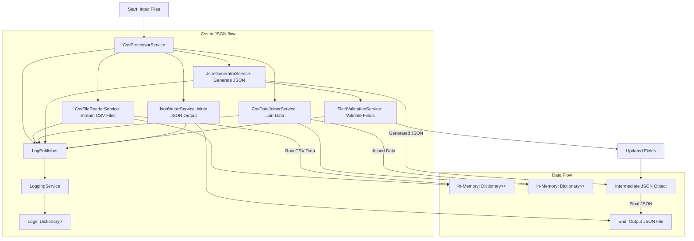

# CSV to JSON with Mapping
## Services Overview
The main services used in this project include:

- **CSVProcessorService**: Orchestrates the entire flow from reading CSV files to generating JSON.
- **CsvDataJoinerService**: Joins data across multiple CSV files based on specified relations.
- **JsonGeneratorService**: Generates the JSON structure from the joined data and mappings.
- **FieldValidationService**: Validates and converts fields based on rules in the mapping configuration.
- **LoggingService**: Tracks progress and logs errors or warnings during the process.


[Mermaid Live Editor](https://mermaid.live/))

---

## Process Flow
### 1. **CSVProcessorService**
The `CSVProcessorService` serves as the entry point for the flow:
1. Reads the mapping and relation configuration files.
2. Validates required files and directories.
3. Invokes `CsvFileReaderService` to read and stream CSV data.
4. Calls `CsvDataJoinerService` to join the data based on relations.
5. Uses `JsonGeneratorService` to convert the joined data into the final JSON structure.
6. Writes the output to a JSON file using `JsonWriterService`.

### 2. **CsvDataJoinerService**
The `CsvDataJoinerService` is a component that links related data from multiple CSV files using relationships defined in the configuration. This ensures that records from different CSV files with matching keys are combined into enriched records, ready for JSON conversion.

#### **Purpose**
- **Data Enrichment**: Enhances the primary records by appending related data from other files.
- **Relational Integrity**: Mimics relational database behavior by linking primary and foreign records through primary key (PK) and foreign key (FK) relationships.

#### **Input**
1. **Relations File**:
   - Specifies how CSV files are related using PK and FK fields.
   - Example Relation:
     ```json
     [
       {
         "PrimaryKey": { "CSVFileName": "Orders.csv", "CSVField": "ID" },
         "ForeignKey": { "CSVFileName": "OrderDetails.csv", "CSVField": "OrderID" }
       }
     ]
     ```
   - **Explanation**: This relation links the `Orders.csv` file (primary file) with the `OrderDetails.csv` file (foreign file) using the `ID` field in `Orders.csv` and the `OrderID` field in `OrderDetails.csv`.

2. **Raw CSV Data**:
   - Stored in memory as a dictionary:
     - **Key**: CSV file name.
     - **Value**: A list of records, where each record is a dictionary with column names as keys and values as field data.
   - Example:
     ```csharp
     Dictionary<string, IEnumerable<IDictionary<string, string?>>> csvData = new()
     {
         "Orders.csv": new List<Dictionary<string, string?>>
         {
             new() { { "ID", "1" }, { "Customer", "John Doe" } },
             new() { { "ID", "2" }, { "Customer", "Jane Smith" } }
         },
         "OrderDetails.csv": new List<Dictionary<string, string?>>
         {
             new() { { "OrderID", "1" }, { "Product", "Widget" } },
             new() { { "OrderID", "1" }, { "Product", "Gadget" } },
             new() { { "OrderID", "2" }, { "Product", "Thingamajig" } }
         }
     };
     ```

---

#### **Processing**
The `CsvDataJoinerService` processes the input data through several steps:

**Step 1: Extract Relation Metadata**
- Parse the relations file to understand how the CSV files are linked.
- Example:
  - Primary CSV File: `Orders.csv` with PK: `ID`.
  - Foreign CSV File: `OrderDetails.csv` with FK: `OrderID`.

**Step 2: Validate CSV Files**
- Ensure both primary and foreign CSV files exist in the provided `csvData`.
- Log errors if any required files or fields are missing.

**Step 3: Build Foreign Key Lookup**
- Create a lookup dictionary from the foreign CSV file:
  - **Key**: FK value.
  - **Value**: A list of records that share the same FK value.
  - **Example**:
    ```csharp
    var foreignKeyLookup = new Dictionary<string, List<Dictionary<string, string?>>>
    {
        "1": new List<Dictionary<string, string?>> 
        {
            new() { { "OrderID", "1" }, { "Product", "Widget" } },
            new() { { "OrderID", "1" }, { "Product", "Gadget" } }
        },
        "2": new List<Dictionary<string, string?>> 
        {
            new() { { "OrderID", "2" }, { "Product", "Thingamajig" } }
        }
    };
    ```    

4. **Join Data**:
   - Iterate over records in the primary CSV file:
     - Extract the PK value for each record.
     - Use the FK lookup to find related records from the foreign CSV file.
     - Add the original primary record fields and the related foreign records to a new dictionary.
   - **Example**:
     - **Input Record** (from `Orders.csv`):
       ```json
       { "ID": "1", "Customer": "John Doe" }
       ```
     - **Enriched Record**:
       ```json
       { 
         "ID": "1", 
         "Customer": "John Doe", 
         "OrderDetails.csv": [
           { "OrderID": "1", "Product": "Widget" },
           { "OrderID": "1", "Product": "Gadget" }
         ]
       }
       ```

5. **Handle Missing Relations**:
   - For primary records with no matching foreign records:
     - Add the primary record to the result with an empty list for the related foreign file.
   - Log warnings about unmatched records for debugging.

6. **Finalize Result**:
   - Compile the enriched records into a dictionary with the primary CSV file as the key.
   - **Example**:
     ```csharp
     Dictionary<string, IEnumerable<IDictionary<string, object?>>> result = new()
     {
         "Orders.csv": new List<Dictionary<string, object?>>
         {
             new()
             {
                 { "ID", "1" },
                 { "Customer", "John Doe" },
                 { "OrderDetails.csv", new List<Dictionary<string, object?>>
                     {
                         new() { { "OrderID", "1" }, { "Product", "Widget" } },
                         new() { { "OrderID", "1" }, { "Product", "Gadget" } }
                     }
                 }
             },
             new()
             {
                 { "ID", "2" },
                 { "Customer", "Jane Smith" },
                 { "OrderDetails.csv", new List<Dictionary<string, object?>>
                     {
                         new() { { "OrderID", "2" }, { "Product", "Thingamajig" } }
                     }
                 }
             }
         }
     };
     ```

#### **Why It Is Necessary**
- **Data Enrichment**: Combining related data provides a comprehensive view of records, ensuring all necessary details are available in the final output.
- **Relational Integrity**: Mimics relational database behavior, linking records using PK-FK relationships.
- **Flexibility**: Handles dynamic relationships and supports complex nested data structures, making it suitable for varied use cases.
- **Scalability**: Efficient lookups and processing enable handling large datasets without excessive resource use.

---

### 3. **JsonGeneratorService**

The `JsonGeneratorService` is a core component designed to convert CSV data into JSON objects based on flexible mappings, validations, and relations. It processes both flat and nested mappings to generate a structured JSON output.

#### **Purpose**
- **JSON Transformation**: Converts CSV data into JSON objects based on user-defined mappings.
- **Validation Enforcement**: Applies validation rules on fields during processing.
- **Relational Mapping**: Handles relationships between primary and foreign keys in CSV files for nested JSON structures.

#### **Input**
1. **Mapping Configuration**:
   - Specifies how CSV fields map to JSON fields.
   - Includes validations, default values, and nested field configurations.
2. **CSV Data**:
   - Raw data provided as a dictionary:
     - **Key**: CSV file name.
     - **Value**: List of records where each record is a dictionary of field-value pairs.
3. **Relations**:
   - Defines relationships between CSV files using primary and foreign keys.
4. **Joined Data**:
   - Data prepared by linking related CSV records using relationships, provided as a dictionary:
     - **Key**: Primary file name in the relationship.
     - **Value**: List of enriched records.

#### **Processing**
**1. Initialization**
- Initializes the total count of fields to process, including nested fields.
- Creates a result structure to store the generated JSON objects.

**2. Process Flat Field Mappings**
- **Validation**: Checks if required fields (e.g., `JSONField`) are present.
- **CSV Data Access**:
  - Fetches the appropriate CSV file.
  - Retrieves the record at the specified index.
  - Applies validations on the field value.
- **Fallback**: Uses default values for missing fields.

**3. Process Nested Field Mappings**
- Handles fields grouped under a nested JSON object or array.
- **Object-Type Fields**:
  - Converts nested mappings into JSON objects.
  - Adds default values for unsupported or missing fields.
  - Handles validation for each nested field.
  - Stores the completed object in the parent JSON structure.
- **Array-Type Fields**:
  - Creates JSON arrays for relational data using primary and foreign keys.
  - Processes fields without relations separately.
  - Supports multiple rows in related data to build an array of objects.
  - Ensures validation is applied to all elements within the array.

**4. Handle Relationships**
- Identifies relationships between CSV files:
  - **Primary Key Relations**: Adds fields based on primary key lookups.
  - **Foreign Key Relations**: Maps data between related CSV files.
  - **No Relation**: Processes fields without dependencies.

**5. Handling Missing Data**
- Missing CSV fields or files:
  - Logs warnings and assigns default or empty values.
- Missing relationships:
  - Logs errors and excludes the corresponding data from the output.

**6. Finalize JSON Output**
- Combines all processed fields and nested structures into a final JSON object.
- Adds this object to the result list, ensuring the generated JSON conforms to the specified mapping.

#### **Key Cases**
1. **Fields**
   - Mapped directly from CSV to JSON.
   - Validated during processing, and missing fields trigger warnings or default values.

2. **Nested Field Arrays**
   - Built using joined data or direct relationships.
   - Incorporates multiple records into an array structure.
   - Ensures consistency by validating each array element.

3. **Nested Field Objects**
   - Constructed as a single object within the JSON output.
   - All nested fields are validated and included.

4. **Empty CSV Values**
   - Processed through validation to apply defaults or null values.
   - Ensures no disruption in the JSON structure.

5. **Default Values**
   - Applied when CSV data is missing or null, as specified in the mapping.
   - Ensures output consistency and adherence to configuration.

6. **Relationships**
   - Joined data is utilized to enrich JSON records.
   - Handles both PK and FK relations, logging errors for missing or invalid data.

#### **Key Methods**
**1. `GenerateJsonFromMappings`**
- Main entry point for JSON generation.
- Delegates field and nested field processing to specialized methods.

**2. `ProcessFieldMappings`**
- Processes individual field mappings:
  - Validates field existence in CSV.
  - Applies `FieldValidationService` for value validation.

**3. `ProcessNestedFieldMappings`**
- Processes nested field mappings:
  - Differentiates between `Object` and `Array` types.
  - Handles relationships and default value assignments.

**4. `ProcessFieldWithRelations`**
- Processes fields based on primary and foreign key relations:
  - Looks up joined data for the correct relationship.
  - Validates and maps values to JSON.

**5. `AddEmptyNestedFields`**
- Adds empty nested fields for unsupported configurations.

**6. `ProgressField`**
- Tracks progress for logging purposes.

#### **Examples**
**Mapping Input**
```json
{
  "Fields": [
    {
      "CSVField": "Name",
      "CSVFile": "Users.csv",
      "JSONField": "userName",
      "Validations": {
        "Required": true,
        "Type": "String",
        "Min": 1,
        "Max": 50
      }
    }
  ],
  "NestedFields": [
    {
      "JSONNestedFieldName": "Address",
      "JSONNestedType": "Object",
      "Fields": [
        {
          "CSVField": "Street",
          "CSVFile": "Users.csv",
          "JSONField": "street"
        }
      ]
    }
  ]
}
```

**Generated JSON Output**
```json
[
  {
    "userName": "John Doe",
    "Address": {
      "street": "123 Main St"
    }
  }
]
```


#### **Why It Is Necessary**
- **Data Validation**: Ensures CSV data meets the required structure and constraints before conversion.
- **Flexibility**: Handles complex nested mappings and validations dynamically.
- **Scalability**: Efficiently processes large datasets and relations with minimal resource use.
- **Error Handling**: Provides detailed logging for debugging missing fields, relations, and data.

---

### 4. **FieldValidationService**
The `FieldValidationService` ensures data integrity and correctness by validating and transforming fields according to the rules specified in the mapping configuration.

#### **Validation Rules**
The service applies a series of validation rules to each field:

1. **Required**:
   - Ensures that the field has a value if marked as required.
   - If the field is empty or null, the service checks for a default value from the mapping and logs an error or warning if no value is available.

2. **Type Checking**:
   - Verifies that the field value matches the specified type in the mapping (`string`, `int`, `long`, `double`, `bool`).
   - Logs errors if the type is incorrect.

3. **Min/Max Constraints**:
   - For **string** types: Validates that the number of characters falls within the specified range (`Min` and `Max`).
   - For **numeric** types: Ensures the value is within the allowed range (`Min` and `Max`).

4. **Conversion Rules**:
   - Allows transforming specific field values during validation (e.g., mapping `"yes"` to `true` or `"null"` to `null`).
   - Uses a `ConversionRules` dictionary from the field mapping to perform this transformation.

5. **Error Handling**:
   - Logs validation errors or warnings depending on whether `ValidationsNeedToPass` is true.

#### **Input**
- **Field Value**:
  - The raw value extracted from the CSV.
- **Field Mapping**:
  - A configuration object containing validation rules, type, and conversion information.
  - Example:
    ```json
    {
      "CSVField": "OrderID",
      "CSVFile": "Orders.csv",
      "JSONField": "OrderId",
      "Validations": {
        "Required": true,
        "Type": "int",
        "Min": 1,
        "Max": 9999,
        "ValidationsNeedToPass": true
      },
      "ConversionRules": {
        "yes": true,
        "no": false
      }
    }
    ```

#### **Processing**
The service processes each field in steps:

1. **Normalize Input**:
   - Trim whitespace

2. **Apply Conversion Rules**:
   - Check the `ConversionRules` dictionary for a predefined transformation.
   - Example:
     - Input Value: `"yes"`
     - Conversion: `true`

3. **Validate Required Field**:
   - If `Required` is `true`, check if the field has a value.
   - Use the `DefaultValue` if the field is empty and a default is specified.

4. **Type Validation**:
   - Ensure the value matches the type in the mapping.
   - Example:
     - Field Type: `int`
     - Input: `"123"`
     - Parsed Output: `123`

5. **Min/Max Validation**:
   - Compare the value (or its length for strings) against `Min` and `Max` constraints.
   - Example:
     - Field Type: `int`
     - Input: `500`
     - Min: `100`, Max: `1000` → Valid

6. **Handle Validation Errors**:
   - Log errors or warnings with descriptive messages.

#### **Output**
- Returns the validated and transformed value.
- If validation fails:
  - Logs the error or warning.

#### **Detailed Examples**
1. **String Validation**:
   - Mapping:
     ```json
     { "CSVField": "Customer", "Validations": { "Type": "string", "Min": 3, "Max": 50 } }
     ```
   - Input: `"John"`
   - Output: `"John"` (Valid)
   - Input: `"J"`
   - Output - Error: because `Customer` must have at least 3 characters.

2. **Numeric Validation**:
   - Mapping:
     ```json
     { "CSVField": "OrderID", "Validations": { "Type": "int", "Min": 1, "Max": 9999 } }
     ```
   - Input: `"1234"`
   - Output: `1234` (Valid)
   - Input: `"10000"`
   - Output - Error: because `OrderID` exceeds maximum value of 9999.

3. **Boolean Conversion**:
   - Mapping:
     ```json
     { "CSVField": "IsActive", "Validations": { "Type": "bool" }, "ConversionRules": { "yes": true, "no": false } }
     ```
   - Input: `"yes"`
   - Output: `true`
   - Input: `"maybe"`
   - Output - Error: because `IsActive` must be a boolean value.

#### **Why It Is Necessary**
- **Data Integrity**: Ensures the data adheres to specified requirements, preventing invalid or corrupted data in the output.
- **Schema Compliance**: Matches the target JSON schema expectations for types and constraints.
- **Error Handling**: Provides feedback on issues, making debugging and corrections easier.

---

### 5. **LoggingService**
Tracks progress and logs events during the process:
- Maintains logs categorized by type (e.g., errors, warnings, information).
- Publishes progress updates for monitoring.

---

## Data Storage During Processing

### **In-Memory Data**
1. **Raw CSV Data**:
   - **Structure**: 
     - Stored as a `Dictionary<string, IEnumerable<IDictionary<string, string?>>>`.
     - Each key represents a CSV file name.
     - The value is an `IEnumerable` (collection) of records, where each record is represented as an `IDictionary` mapping column names (keys) to their values.
   - **Example**:
     ```csharp
     var csvData = new Dictionary<string, IEnumerable<IDictionary<string, string?>>>
     {
         {
             "Orders.csv",
             new List<Dictionary<string, string?>>
             {
                 new() { { "OrderID", "1" }, { "Customer", "John Doe" } },
                 new() { { "OrderID", "2" }, { "Customer", "Jane Smith" } }
             }
         }
     };
     ```

   - **Why `Dictionary<string, IEnumerable<IDictionary<string, string?>>`?**
     - **Flexibility**: Supports a flexible number of files, each with variable column names and types.
     - **Generic Record Representation**: Allows working with data without pre-defining a rigid schema.
     - **Lazy Processing**: The `IEnumerable` enables efficient iteration, reducing memory overhead when working with large datasets.

2. **Joined Data**:
   - **Structure**:
     - Stored as a `Dictionary<string, IEnumerable<IDictionary<string, object?>>>`.
     - Similar to raw CSV data but enriched with related records from foreign files.
     - Each key is a primary CSV file, and the value is a collection of enriched records.
   - **Example**:
     ```csharp
     var joinedData = new Dictionary<string, IEnumerable<IDictionary<string, object?>>>
     {
         {
             "Orders.csv",
             new List<Dictionary<string, object?>>
             {
                 new()
                 {
                     { "OrderID", "1" },
                     { "Customer", "John Doe" },
                     { "OrderDetails.csv", new List<Dictionary<string, object?>>
                         {
                             new() { { "OrderID", "1" }, { "Product", "Widget" } },
                             new() { { "OrderID", "1" }, { "Product", "Gadget" } }
                         }
                     }
                 }
             }
         }
     };
     ```

   - **Why Similar Structure?**
     - **Consistency**: Aligns with the raw CSV data structure for smooth processing.
     - **Enhanced Capability**: Supports storing both primitive values and complex nested collections (`object?`).

### **Intermediate Results**
1. **Validated Fields**:
   - Temporarily stored during processing in a JSON-like structure.
   - Example:
     ```json
     {
         "OrderId": 1,
         "CustomerName": "John Doe",
         "OrderDetails": [
             { "ProductName": "Widget" },
             { "ProductName": "Gadget" }
         ]
     }
     ```

2. **Logs**:
   - Stored in memory as a `Dictionary<string, List<string>>`.
   - Example:
     ```csharp
     var logs = new Dictionary<string, List<string>>
     {
         { "Error", new List<string> { "Missing required field: OrderID" } },
         { "Warning", new List<string> { "Value out of range for field: Quantity" } }
     };
     ```

### **Final Output**
1. **JSON Data**:
   - Generated using the `JsonWriterService` and written to a file.
   - Represents the fully processed and validated structure.

---

## Design Decisions
### **Why Use `IDictionary`?**
- **Dynamic Field Names**:  
  Using `IDictionary` allows handling CSV files with unknown or dynamic schemas, where column names may vary between files. This flexibility makes it possible to process different CSV files without requiring a predefined structure or schema, accommodating various format.
  
- **Efficient Lookups**:  
  With `IDictionary`, field values can be accessed directly using column names as keys, providing fast and intuitive access to specific data points. This is particularly useful when dealing with large datasets or when performing field-specific operations.

### **Why Use `IEnumerable`?**
- **Lazy Evaluation**:  
  The use of `IEnumerable` enables data to be processed row-by-row as needed, rather than loading the entire dataset into memory. This streaming approach is crucial when working with large CSV files, as it significantly reduces memory usage and improves performance.

- **Compatibility**:  
  `IEnumerable` integrates seamlessly with LINQ, allowing for powerful data manipulation. LINQ can be used for filtering, transformations, and aggregations, providing a clean and expressive way to work with the data.

---
